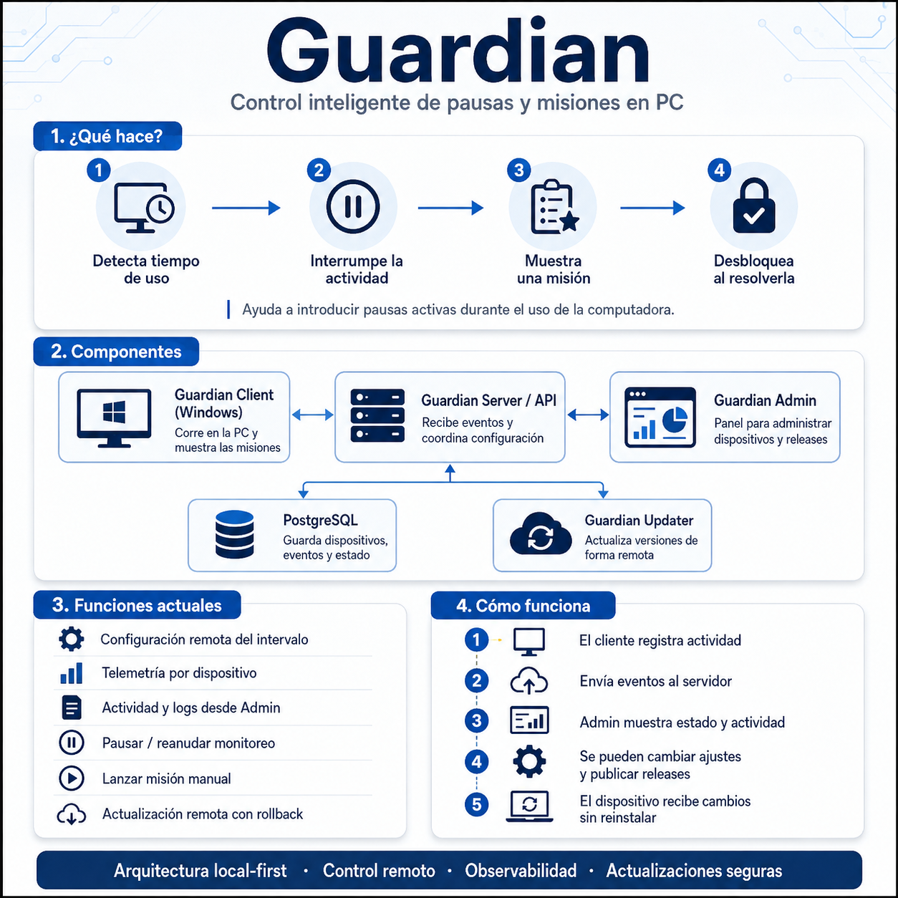

# Guardian

Guardian es una aplicación Windows **local-first** que interrumpe periódicamente el uso de la computadora y solicita una misión antes de permitir continuar.

Además del cliente local, Guardian incluye un servidor central y un panel de administración para configurar dispositivos, consultar actividad, gestionar releases, controlar el monitoreo y ejecutar actualizaciones remotas.

## Cómo funciona Guardian

La siguiente infografía resume los componentes principales y el flujo general de funcionamiento de Guardian.

<p align="center">
  
</p>

**Versión actual:** `0.3.3`

## Estado actual

La versión `0.3.3` incluye:

- registro e identificación persistente de dispositivos;
- heartbeat y estado Online/Offline;
- configuración remota del intervalo;
- telemetría centralizada en PostgreSQL;
- eventos locales persistentes y sincronización posterior;
- vista de actividad por dispositivo;
- nombre visible editable;
- controles remotos de monitoreo;
- misión manual remota;
- releases con SHA-256 y descripción;
- updater separado con upgrade y downgrade;
- rollback;
- estados de actualización visibles desde Admin;
- funcionamiento local-first cuando el servidor o la red no están disponibles.

El motor actual de misiones sigue siendo determinístico y matemático. Las futuras capacidades del motor de misiones se desarrollan por etapas separadas.

## Componentes

- `src/Guardian/Guardian.cs`: cliente Windows WPF/.NET Framework.
- `updater/src/GuardianUpdater.cs`: updater separado para reemplazo, upgrade, downgrade y rollback.
- `server/`: FastAPI + Guardian Admin + SQLAlchemy/Alembic.
- `deploy/docker-compose.yml`: PostgreSQL, Guardian Server y Cloudflare Tunnel opcional.
- `scripts/`: build, pruebas, servidor, backups y publicación manual de releases.
- `docs/`: arquitectura, seguridad, despliegue, esquema de eventos y especificaciones públicas.

## Arquitectura

```text
Guardian Client
      │
      ├── heartbeat
      ├── configuración remota
      ├── comandos remotos
      ├── telemetría
      └── updates
      │
      ▼
Guardian Server / API
      │
      ├── Guardian Admin
      └── PostgreSQL

Guardian Updater
      │
      └── Releases publicados
```

El cliente está diseñado para seguir funcionando aunque el servidor central no esté disponible temporalmente.

## Servidor local

Crear `.env` a partir de `.env.example` y completar los valores reales únicamente de forma local.

```powershell
Copy-Item .env.example .env
```

Configurar los secretos y luego ejecutar:

```powershell
.\scripts\setup-server.ps1
```

URLs locales por defecto:

```text
http://localhost:8080/health
http://localhost:8080/admin/
```

Para detener el servidor sin borrar datos:

```powershell
.\scripts\stop-server.ps1
```

Para volver a iniciarlo:

```powershell
.\scripts\start-server.ps1
```

Para actualizar contenedores/código del servidor conservando los datos:

```powershell
.\scripts\update-server.ps1
```

> Las actualizaciones normales no deben eliminar los volúmenes de PostgreSQL.

## Cliente

Build:

```powershell
.\scripts\build.ps1
```

Self-test:

```powershell
.\scripts\self-test.ps1
```

Modo de prueba local:

```powershell
.\scripts\run-test-mode.ps1
```

El cliente utiliza como configuración local:

```text
%LOCALAPPDATA%\Guardian\config.json
```

Si el dispositivo ya tiene un `DeviceToken`, lo reutiliza. En un registro inicial puede utilizar temporalmente el `DEVICE_BOOTSTRAP_TOKEN` configurado localmente y, después del registro exitoso, conserva el token específico del dispositivo.

## Dispositivos

Cada instalación tiene un `DeviceId` UUID persistente.

El servidor mantiene, entre otros datos:

- ID técnico;
- hostname (`machine_name`);
- nombre visible (`display_name`);
- versión instalada;
- último heartbeat;
- estado Online/Offline;
- intervalo configurado;
- estado de monitoreo.

El nombre visible puede editarse desde Admin sin modificar el hostname ni el ID técnico.

## Configuración remota

El intervalo entre misiones puede modificarse por dispositivo desde Guardian Admin.

El cliente:

- consulta configuración por polling;
- persiste la última configuración válida;
- aplica cambios sin reinstalación;
- continúa usando la última configuración disponible si el servidor queda temporalmente inaccesible.

## Estado de Guardian

Admin distingue entre:

### Activo

Guardian está online y el contador automático de misiones está habilitado.

### Pausado

Guardian continúa ejecutándose y conectado, pero no dispara misiones automáticamente.

Mientras está pausado sigue:

- enviando heartbeat;
- sincronizando telemetría;
- consultando configuración;
- recibiendo updates;
- recibiendo comandos remotos.

### Offline

No se recibió heartbeat dentro del umbral esperado.

`Offline` no equivale a `Pausado`: si el proceso está cerrado, Admin no puede ejecutar comandos hasta que Guardian vuelva a conectarse.

## Controles remotos

Para clientes compatibles, Guardian Admin permite:

- pausar misiones;
- reanudar misiones;
- disparar una misión manual.

La misión manual puede ejecutarse incluso estando pausado y, al terminar, conserva el estado previo de monitoreo.

Los cambios realizados localmente desde la bandeja de Windows también se reflejan en Admin mediante heartbeat.

## Telemetría central

Guardian mantiene dos niveles de telemetría.

### Local

```text
events.jsonl
events-pending.jsonl
```

Cada evento tiene un `eventId` único y la versión del cliente.

### Central

El cliente envía eventos por lotes al servidor, que los persiste en PostgreSQL.

Flujo:

```text
evento
↓
persistencia local
↓
cola pendiente
↓
envío al servidor
↓
confirmación de IDs aceptados
↓
retiro de pendientes confirmados
```

Si no hay red o servidor:

- Guardian sigue funcionando;
- los eventos permanecen locales;
- se reintenta posteriormente con backoff;
- el servidor deduplica por `event_id`.

Los accesos a la cola local están sincronizados para evitar conflictos entre procesos/hilos y un error de telemetría no debe cerrar Guardian.

## Actividad por dispositivo

Desde Admin se puede abrir `Ver actividad` para consultar eventos de cada dispositivo.

La vista permite filtrar por:

- hoy;
- ayer;
- fecha específica;
- misiones;
- configuración;
- actualizaciones;
- errores;
- control remoto.

Los eventos se muestran en formato compacto. El payload JSON se conserva en el servidor para diagnóstico, pero la tabla actual de Activity no lo despliega ni muestra respuestas escritas.

Desde 0.4.6, MissionFailed y MissionSolved guardan en telemetría la respuesta original enviada, el intento y el nivel de ayuda vigente; los fallos incluyen la clasificación existente. Estas respuestas son datos sensibles: no se imprimen en consola, no se agregan a mensajes de error ni se incluyen en ejemplos o fixtures del repositorio.

La zona horaria de Admin puede configurarse con:

```text
GUARDIAN_ADMIN_TIMEZONE
```

usando una zona IANA disponible en el entorno del servidor.

## Releases

`VERSION` es la fuente principal de versión.

Para publicar un release:

```powershell
.\scripts\publish-release.ps1 -Description "Descripción breve del release."
```

El script:

1. ejecuta pruebas/self-tests;
2. compila Guardian y Guardian Updater;
3. genera el ZIP;
4. calcula SHA-256;
5. copia el artefacto a `releases/`;
6. registra la metadata en Guardian Server cuando el entorno está configurado.

Cada release puede incluir:

- versión;
- descripción;
- archivo ZIP;
- SHA-256.

La versión instalada de un dispositivo y el último release publicado son conceptos independientes.

## Flujo recomendado de publicación

Para cada versión nueva:

```text
publicar release
↓
actualizar dispositivo de prueba/staging
↓
validar actividad, versión y comportamiento
↓
recién después actualizar el dispositivo real
```

Guardian Admin no envía automáticamente releases a todos los dispositivos.

## Updater

Guardian Updater es un ejecutable separado del cliente principal.

Flujo general:

```text
comando de actualización
↓
descarga
↓
validación SHA-256
↓
backup
↓
cierre de Guardian
↓
reemplazo de binarios
↓
inicio de la versión destino
↓
validación
```

El sistema soporta:

- upgrade;
- downgrade/rollback.

El ciclo conserva metadata de versión origen, versión destino y dirección de la actualización.

Los estados de update pueden visualizarse desde Admin, incluyendo situaciones como:

- pendiente;
- esperando que el dispositivo se conecte;
- en progreso;
- success;
- failed;
- cancelled.

Una actualización que todavía no fue tomada por el dispositivo puede cancelarse desde Admin.

## Instalación y autoarranque

Guardian puede configurar autoarranque mediante Windows.

El watchdog ayuda a recuperar cierres inesperados.

Una salida intencional se distingue de un cierre inesperado para evitar reinicios no deseados.

Las actualizaciones preservan la configuración y los datos locales necesarios.

## Base de datos

Guardian Server utiliza PostgreSQL.

Los cambios de esquema se gestionan mediante Alembic.

No exponer PostgreSQL directamente a Internet.

No eliminar volúmenes durante actualizaciones normales.

## Seguridad

El repositorio público no debe contener:

- `.env` real;
- contraseñas;
- tokens;
- credenciales;
- datos personales;
- logs reales;
- configuraciones reales;
- backups.

Los valores públicos de ejemplo viven en `.env.example`.

Guardian Admin puede protegerse mediante Cloudflare Access cuando se expone fuera de la red local.

La autenticación del cliente contra la API es independiente de la sesión web del Admin.

## Backups

El proyecto incluye scripts de backup para los datos del servidor.

Los backups reales no deben versionarse ni subirse al repositorio público.

## Pruebas

Servidor:

```powershell
.\server\.venv\Scripts\python.exe -m pytest server\tests
```

Build:

```powershell
.\scripts\build.ps1
```

Self-tests:

```powershell
.\scripts\self-test.ps1
```

Antes de publicar una versión, validar siempre los tests relevantes y luego realizar una prueba real primero en un dispositivo de staging.

## Documentación

Documentación técnica adicional:

- `docs/architecture.md`
- `docs/deployment.md`
- `docs/security.md`
- `docs/update-flow.md`
- `docs/EVENT_SCHEMA.md`
- especificaciones públicas disponibles dentro de `docs/`

## Desarrollo

Las nuevas funcionalidades se trabajan en ramas `feature/...` creadas desde una versión estable de `main`.

Antes de mergear/pushear:

- revisar tests;
- revisar documentación;
- auditar secretos;
- auditar datos personales;
- confirmar que `.env`, logs, configs y backups siguen ignorados.

Las reglas permanentes para agentes/Codex están en:

```text
AGENTS.md
```
